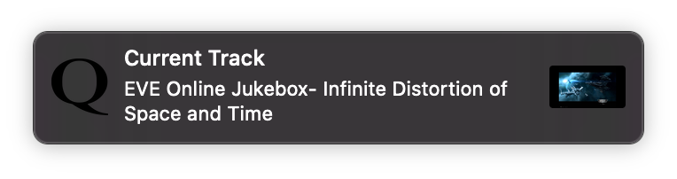

# QTube

QTube is a music player that can search Last.fm and play tracks from YouTube.

## Features

- Search Google and Last.fm
- Search related tracks through Last.fm
- Qt GUI with native look and feel
- Locally stored playlists
- Restores track progress
- Media key support
- Timestamp entry
- Search within playlists
- Duplicate track removal
- Sorting, search, drag & drop, track editing, etc.
- Copy & paste of tracks across playlists
- Playback modes including shuffle and loop
- Works without YouTube account
- Video thumbnails with adjustable quality
- System notifications with thumbnails
- Additional features with Google and Last.fm API keys

## Installation

Start QTube by running "main.py". The system needs a working Python installation. To install required Python packages, install the packages from "requirements.txt" by running "pip install -r requirements.txt". Alternatively, installing the packages should satisfy all Python dependencies:

- pyqt
- PyQtWebEngine
- pynput
- requests
- numpy
- youtube-dl

For a more native look, a Makefile is included that can produce a standalone executable by running "make app".

## Configuration

QTube is intended to work without additional configuration but depends on Last.fm and a Google API keys for many of its features. By default, those can be configured by putting API keys into the files ".qtube/lastfm_apikey" (a single line) and ".qtube/google_keys" (one per line), both in the user's home directory. API keys for free versions of those services can be created under [https://www.last.fm/api/account/create](https://www.last.fm/api/account/create) and [https://console.cloud.google.com/apis/credentials](https://console.cloud.google.com/apis/credentials). 

Use of the Google search feature will count towards the API key's quota. The Last.fm API currently appears to only limit use by setting a ceiling on how quickly consecutive calls to their service can be made. Regular use of QTube has not shown to exceed these limits. QTube is intended to make sparing use of both APIs and be considerate in the use of those resources.  

## Use

As shown in the screenshot above, QTube's main window is divided in a left side showing playlists and a right side showing a playlist's tracks. Playlists can be created by typing a name into the text box on the top left, the playlist editor, and hitting the "Enter" key. Various kinds of searches can be done by using the text box on the top right, the search bar. 

The following search bar features are available:

- Enter search term and hit "Enter" to search through Last.fm.
- Prefix a search with "g:" to search on YouTube, using the faster Google API (but uses API key).
- Prefix a search with "y:" to search on YouTube, with the slower youtube-dl (uses no API key).
- Prefix an entry with "/" to filter the current playlist to tracks matching the following text, as you type.

Search results will appear in the playlist "Search Results" at the top of the playlist view on the left. A grey text color in the search bar indicates that a search is ongoing. Add songs to playlists by dragging tracks from the track view on the right side onto any of the playlists on the left side.

Track information from Last.fm will be used by QTube to locate a matching video on YouTube. Title and YouTube video ID can be edited at any time by selecting the track and corresponding column, then hitting "Enter". Double click a track to play it. The name of the playlist with the currently playing track will be shown in bold. Clicking the name of any playlists will bring up its tracks and scoll the track view to the currently playing track if the playlist clicked contains the currently playing track.

A track from Last.fm might not be resolved to an appropriate YouTube video. In those cases, a different, perhaps more complete title can be entered before playing a track or by editing the video ID of a track to match the desired YouTube video. Among other places, the ID of any YouTube video can be found in the URL of any video on the YouTube website and can be copied into the "ID" field of any track. QTube will then play the YouTube video for that ID whenever that track is played. One can also use a separate YouTube search (from within QTube) by prefixing the search with "g:" or "y:", as explained above, and then rename any tracks from those search results (using the editing feature) with the track information from Last.fm.

Right clicking on one or more selected tracks brings up a context menu in which the following features are available:

- Search for tracks related to the clicked track through Last.fm.
- Remove any duplicates within the selection.
- Refresh information of selected tracks through YouTube.
- Refresh thumbnails with highest quality versions available.

On the bottom right are the usual controls for jumping to the previous and next song; toggling between play and pause; a volume slider; and to the very right the play mode can be switched by clicking on the button showing an "N" (normal) for sequential playback, "S" (shuffle) for random playback order, and "L" (loop) to automatically repeat a track endlessly (manually triggering a jump to the previous or next track, through the UI controls or any shortcuts, will put the previous or next song on repeat). 

## Shortcuts

- Cmd+1 - Cmd+0: jump within current track, in increments of 10% of the track length.
- Cmd+w: focus the playlist view.
- Cmd+e: focus the track view.
- Cmd+f: focus the search bar.
- Cmd+s: focus the playlist editor.
- Cmd+t: edit the timestamp.
- Cmd+r: rearrange the track view.
- Cmd+g: bring up the track context menu.
- Cmd+c: copy the selected tracks.
- Cmd+x: cut the selected tracks.
- Cmd+v: paste tracks into current playlist.
- Cmd+d or Backspace: delete the selected tracks.
- Cmd+{: jump to previous track (global shortcut).
- Cmd+}: jump to next (global shortcut).
- Cmd+|: toggle between play and pause (global shortcut).
- Cmd+O: show track information (global shortcut).

On Windows and Linux, these shortcuts should be accessible by pressing "Ctrl" instead of "Cmd". The standard shortcut for the respective operating system can be used to toggle between fullscreen and windowed mode.

## Technical

All playlists are saved locally, as JSON in QTube's home direcotry, in the subdirectory ".qtube/playlists.json". This file can be backed up, copied or edited without impairing function of QTube (as long as the JSON syntax scheme is followed).

Thumbnails for tracks are retrieved from YouTube and stored in QTube's home directory, in the subdirectory ".qtube/thumbnails/". While those thumbnails are small and have not been found to exceed 100 MB in size, with playlists containing several thousands of track, they can be cleared whenever desired. Tracks with missing thumbnails will show up without icon but not be impacted in any other way. Missing icons are loaded on playback and high resolution thumbnails can be loaded on demand by the user, using the context menu. Tracks in search results are initially shown without icon, so as to speed up retrieval and display of search results.

## Testing

Some testing on Mac OS, with Python 3.10 and Qt5. Uses youtube-dl for non-API requests. Other operating systems, such as Linux and Windows, should work but are as of yet untested. Provided as is.
